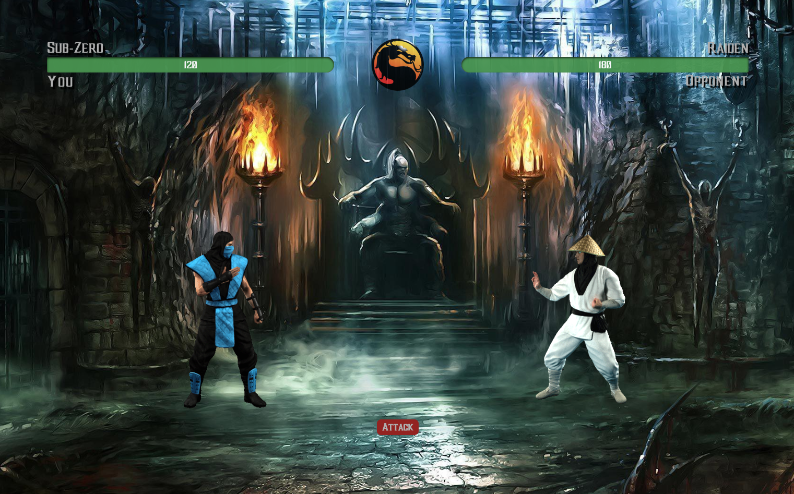

# MK RPG Game

[Game Page](https://nguyenchris.github.io/unit-4-game/)

## Description

This web-browser based game was primarly focused on dynamically updating the DOM using jQuery--this includes: animate methods, mouse and click events, changing CSS styling, creating elements and appending to the HTML, and more. My goal with while creating this was to create a smooth and pleasant performing game for the user. To make it more interactive/immersive, it also includes audio for sound effects, player selection, and more. 

It features a player selection menu where--depending on the user's selection of choice as well as the selection of the opponent--it will display a video-game-like experience. In order to attack, the user would click on the attack button and then experience dynamically changing elements on the UI. Each time the user attacks, their character's Attack Power increases by its base Attack Power.  The defender will then counter attack with the same attack power for each turn. Each character has different attack and counter attack powers. After the user beats a defender, they will move on and select the next opponent--while retaining the same health points from the previous round.

NOTE: Optimized for Google Chrome Browser only.

## Preview

